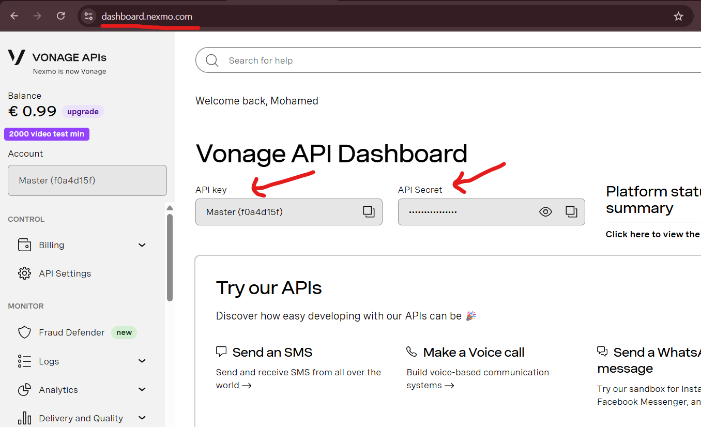

# Send SMS with Laravel, OTP example

- [Concept Intoduction](#concept-intoduction)
- [1. Frontend Setup: International Phone Input](#1-frontend-setup-international-phone-input)
- [2. Backend Setup: Configuring Vonage for SMS](#2-backend-setup-configuring-vonage-for-sms)
  - [What Vonage Does](#what-vonage-does)
  - [Step 1: Create a Vonage Account](#step-1-create-a-vonage-account)
  - [Step 2: Install Laravel Package](#step-2-install-laravel-package)
  - [Step 3: Add API Credentials to `.env`](#step-3-add-api-credentials-to-env)
  - [Step 4: Configure Laravel](#step-4-configure-laravel)
- [3. Phone Number OTP Verification](#3-phone-number-otp-verification)

## Concept Intoduction
To implement SMS funtionality in a Laravel project, the most reliable and flexible way is to use Laravel's built-in **Notification** system along with an SMS gateway like **Vonage** (formerly Nexmo). This approach leverages Laravel's elegant notification channel architecture while keeping the implementation clean and scalable.

On the frontend, capturing valid international phone numbers can be tricky. The [`intl-tel-input`](https://intl-tel-input.com/storybook/?path=/docs/intltelinput--vanilla) JavaScript library provides a robust and user-friendly UI for entering and validating international phone numbers. It ensures consistency and accuracy in the format of numbers sent to the backend.

## 1. Frontend Setup: International Phone Input

When sending SMS, phone numbers must be in **E.164 international format** (e.g. `+966512345678`). If a user enters a number like `0512345678`, the SMS service (like Vonage) won’t recognize it properly, and delivery will fail.

To handle this, the [`intl-tel-input`](https://github.com/jackocnr/intl-tel-input) package provides:

- A country selector with flags

- Number formatting based on country

- Validation to check if the number is actually valid

- Conversion to international format (e.g. from `0612345678` to `+212612345678`)

This makes it much easier to collect reliable phone numbers from users, especially in multilingual or international applications.

**<u>a. Install the package</u>**

```shell
npm install intl-tel-input
```

**<u>b. Load the CSS</u>**

In your main JavaScript file (e.g. `resources/js/app.js`):

```js
import '../css/app.css';
import './bootstrap';
import 'intl-tel-input/build/css/intlTelInput.css';
```

This adds the necessary styles for the country dropdown and input formatting.

**<u>c. Vue Component – Login with Phone Number</u>**

Here’s a simplified login form using Vue.js and Inertia. It captures the phone number and formats it using `intl-tel-input`.

```js
<script setup>
import { ref, onMounted } from 'vue';
import { useForm } from '@inertiajs/vue3';
import intlTelInput from 'intl-tel-input';
import { ar } from "intl-tel-input/i18n"; // import language

const iti = ref(null);

const form = useForm({
  phone: '',
});

// Initialize intl-tel-input on mount
onMounted(() => {
  const input = document.querySelector('#phone');

  iti.value = intlTelInput(input, {
    i18n: ar, // lang
    initialCountry: 'sa', // Default country (Saudi Arabia)
    onlyCountries: ['sa', 'ma', 'ae', 'kw'], // Allowed countries
    countryOrder: ["sa", "ma", "ae", "kw"], // Countries order
    loadUtils: () => import("intl-tel-input/utils"), // For validation & formatting
  });
});

// Form submission logic
function submit() {
  // Validate number before sending it to backend
  if (!iti.value || !iti.value.isValidNumber()) {
    alert('Invalid phone number');
    return;
  }

  // Convert the number to international format (e.g. +966512345678)
  form.phone = iti.value.getNumber();

  // Submit to backend route
  form.post(route('login'), {
    onSuccess: () => form.reset(),
    onError: () => alert('Login failed'),
  });
}
</script>

<template>
  <form @submit.prevent="submit">
    <!-- Phone input field that intl-tel-input attaches to -->
    <input type="tel" id="phone" placeholder="Enter your phone number" />

    <!-- Submit button -->
    <button type="submit" :disabled="form.processing">Login</button>
  </form>
</template>
```

After formatting the number, the backend will receive it in a format that works with SMS services like Vonage or Twilio.

## 2. Backend Setup: Configuring Vonage for SMS

To send SMS messages from Laravel, we’ll use **Vonage** (formerly Nexmo), a reliable service for global SMS delivery. Laravel provides a first-party notification channel for Vonage, making it easy to integrate.

#### What Vonage Does

Vonage acts as the gateway to send SMS to real mobile numbers around the world. Once your app formats a phone number correctly (as we did on the frontend), Vonage takes care of:

- Delivering the message to the recipient’s carrier

- Handling delivery status

- Providing message logs and analytics via their dashboard

#### Step 1: Create a Vonage Account

1. Go to [Authentication](https://dashboard.nexmo.com/sign-up)

2. Verify your email and phone number

3. Once inside the dashboard, locate your **API Key** and **API Secret**



#### Step 2: Install Laravel Package

Run the following command to install the Vonage notification channel:

```shell
composer require laravel/vonage-notification-channel guzzlehttp/guzzle
```

> `guzzlehttp/guzzle` is required to send HTTP requests to the Vonage API.

#### Step 3: Add API Credentials to `.env`

Add your Vonage credentials to the `.env` file:

```php
VONAGE_KEY=xxxxxxxx
VONAGE_SECRET=xxxxxxxxxxxxxxxx
VONAGE_SMS_FROM=0612345678
```

- `VONAGE_KEY` and `VONAGE_SECRET`: From your Vonage dashboard

- `VONAGE_SMS_FROM`: The sender number (can be a real number or a registered alphanumeric sender ID depending on your account and country rules)

> ⚠️ Some countries require pre-approved sender IDs. For development, you can use your verified test number.

## 3. Phone Number OTP Verification

Start by adding the following fields to your `users` migration:

```php
$table->string('phone')->unique()->nullable();
$table->timestamp('phone_verified_at')->nullable();
$table->string('otp_code')->nullable();
$table->timestamp('otp_expires_at')->nullable();
```

Make sure your `User` model:

- Uses the `Notifiable` trait

- Has a `routeNotificationForVonage()` method to tell Laravel where to send the SMS

```php
use Illuminate\Notifications\Notifiable;

class User extends Authenticatable
{
    use Notifiable;

    public function routeNotificationForVonage(Notification $notification): string
    {
        return $this->phone;
    }
}

```

Create the Notification Class

```shell
php artisan make:notification PhoneVerification
```

Then update the class to send the OTP via Vonage:

```php
use Illuminate\Notifications\Notification;
use Illuminate\Notifications\Messages\VonageMessage;

class PhoneVerification extends Notification
{
    public function __construct(private string $otp) {}

    public function via(object $notifiable): array
    {
        return ['vonage'];
    }

    public function toVonage(object $notifiable): VonageMessage
    {
        return (new VonageMessage)
            ->content("Your OTP is {$this->otp}. This code will expire in 5 minutes. ");
    }
}


```

In your login controller:

```php
public function store(Request $request): RedirectResponse
{
    // rate limit
    $key = 'otp-send:' . $request->ip();
    if (RateLimiter::tooManyAttempts($key, 5)) {
        return back()->withErrors(['phone' => 'Too many attempts. Please try again in a 5 minute.']);
    }
    RateLimiter::hit($key, 60 * 5); // lock the IP for 5 minutes
    
    $request->validate([
        'phone' => 'required|string|max:255|min:3',
    ]);

    $user = User::where('phone', $request->phone)->first();

    if (! $user || $user->phone_verified_at === null) {
        return back()->withErrors(['phone' => __('auth.failed')]);
    }

    // Generate 6-digit OTP
    $otp = rand(100000, 999999);

    // Store OTP and expiration
    $user->update([
        'otp_code' => $otp,
        'otp_expires_at' => now()->addMinutes(5),
    ]);

    // Send OTP via SMS
    $user->notify(new PhoneVerification($otp));

    // Store masked phone in session for display
    session(['phone' => str_repeat('*', strlen($user->phone) - 4) . substr($user->phone, -4)]);

    // Temporarily store user ID for OTP verification
    session(['otp_user_id' => $user->id]);

    // Log the user out (if they were already logged in)
    auth()->logout();

    return redirect()->route('phone.otp');
}
```

In your OTP controller:

```php
public function verifyOTP(Request $request)
{
    $request->validate([
        'otp' => 'required|digits:6',
    ]);

    $user = User::find(session('otp_user_id'));

    if (! $user || $user->otp_code !== $request->otp || now()->gt($user->otp_expires_at)) {
        return back()->withErrors(['otp' => 'Invalid or expired code.']);
    }

    // Clear OTP fields and verify phone
    $user->update([
        'otp_code' => null,
        'otp_expires_at' => null,
        'phone_verified_at' => now(),
    ]);

    // Log in the user
    Auth::login($user);
    $request->session()->regenerate();

    // Clean up
    session()->forget(['otp_user_id', 'phone']);

    return redirect()->intended(route('dashboard', absolute: false));
}
```

#### Protect Routes with Middleware

Create a middleware to block access for users without verified phones:

```php
class PhoneVerificationMiddleware
{
    public function handle(Request $request, Closure $next)
    {
        if (!$request->user() || is_null($request->user()->phone_verified_at)) {
            return $request->expectsJson()
                ? response()->json(['message' => 'Phone number must be verified.'], 403)
                : redirect()->route('home');
        }

        return $next($request);
    }
}
```

Then register it in `bootstrap/app.php` (Laravel 11 structure):

```php
$middleware->alias([
    'phone_verified' => \App\Http\Middleware\PhoneVerificationMiddleware::class,
]);
```

Now apply the middleware to protected routes:

```php
Route::middleware(['auth', 'phone_verified'])->group(function () {
    Route::get('/dashboard', DashboardController::class)->name('dashboard');
});
```


