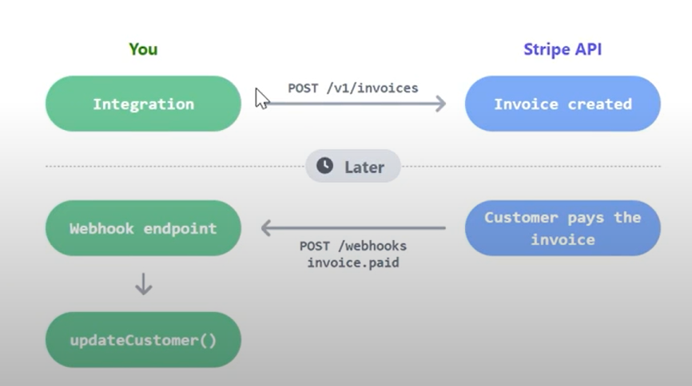

# Stripe Integration Workflow with Laravel

## Table of Contents

- [Introduction to Stripe Integration](#introduction-to-stripe-integration)
- [Step 1: Install Stripe PHP Package](#step-1-install-stripe-php-package)
- [Step 2: Set Up Secret Key](#step-2-set-up-secret-key)
- [Step 3: Create Checkout Button and Route](#step-3-create-checkout-button-and-route)
- [Step 4: Generate Checkout Session and Handle Payment](#step-4-generate-checkout-session-and-handle-payment)
- [Step 5: Success and Failure Pages](#step-5-success-and-failure-pages)
- [Step 6: Stripe Webhooks for Order Update](#step-6-stripe-webhooks-for-order-update)
- [Step 7: Webhook Implementation](#step-7-webhook-implementation)
- [Using Laravel Cashier for Stripe Integration](#using-laravel-cashier-for-stripe-integration)


Stripe is one of the most popular payment gateways, offering a seamless and secure way to handle online payments. Integrating Stripe with Laravel is straightforward and highly efficient for most projects. This guide explains the integration workflow in two parts:

1. **A theoretical overview** of the payment workflow.
2. **A Laravel implementation** of the workflow.

Below is the complete workflow of implementing Stripe payments. The accompanying image illustrates the process step by step.


---

## 1. Payment Workflow Overview

### Step 1: Initiating Checkout

When the user clicks the **Checkout** button in the browser, a request is sent to the server to initiate the payment process.

### Step 2: Creating a Checkout Session

The server communicates with Stripe using the **secret key** to create a *Checkout Session*. This includes:

- Information about the order items (name, price, quantity).
- Success and failure URLs (where the user is redirected after payment).
- Additional configuration options like the currency and payment methods.

### Step 3: Receiving the Checkout Session Object

Stripe generates a `Checkout Session Object`, which contains detailed information about the session, including a unique `session_id` and a **checkout URL**.

### Step 4: Creating an Unpaid Order

The server receives the `Checkout Session Object` and uses its `session_id` to create an **unpaid order** in the database. This allows tracking the order even if the payment process is interrupted.

### Step 5: Redirecting to the Stripe Checkout

The server uses the checkout URL from the `Checkout Session Object` to redirect the user to Stripe’s secure payment page. This can be done in two ways:

1. **Server-side redirect:** The server directly redirects the user to Stripe.
2. **Client-side redirect:** The server sends the URL back to the browser, and the browser handles the redirect.

Either way, the user is presented with Stripe's payment form.

### Step 6: Redirect After Payment

After completing (or failing) the payment, Stripe redirects the user to the appropriate URL based on the payment outcome:

- **Success URL:** Payment was successful.
- **Failure URL:** Payment was unsuccessful or canceled.

### Step 7: Updating the Order on Success

When the user is redirected to the success page, the application retrieves the `session_id` from the URL parameters. Using this `session_id`, the server fetches the related order from the database and marks it as **paid**.

### Note: Handling Redirect Failures

At this point, the payment process works, but there's a potential issue:  
If the user successfully completes the payment but doesn’t return to the success page (e.g., they close the browser or experience a network issue), the payment is processed, but the order remains unpaid in the database.

---

## 2. Using Stripe Webhooks for Reliability

To solve this issue, we use **Stripe Webhooks**.

**What are Webhooks?**  
Webhooks are URLs that listen for events triggered by external systems (like Stripe). In this case, whenever Stripe processes a payment successfully, it sends an event notification to your webhook URL.

### Step 8: Setting Up a Webhook

You can configure a webhook in Stripe’s dashboard to listen for payment-related events, such as `checkout.session.completed`. When a successful payment is detected, Stripe sends a request to the configured webhook URL with the details of the `Checkout Session`.



### Step 9: Updating the Order via Webhooks

When your server receives the webhook request:

1. It retrieves the `session_id` from the event data.
2. Finds the associated order in the database.
3. Marks the order as **paid**.

This ensures the order status is updated even if the user doesn't return to the success page.

## 3. Laravel Implementation:

Stripe provides extensive documentation for developers. In this implementation, we’ll follow the [Accept a Payment](https://stripe.com/docs/payments/accept-a-payment) guide to build our payment process step by step.

#### Step 1: Install the Stripe PHP Package

First, install Stripe's official PHP package using Composer:

```shell
composer require stripe/stripe-php
```

This library allows us to interact with Stripe's API seamlessly.

#### Step 2: Configure the Secret Key

Retrieve your **Secret Key** from the Stripe Dashboard. You can find it under the API keys section. Add this key to your Laravel project's `.env` file:

```php
// .env
STRIPE_SECRET=sk_test_abc123
```

Next, ensure the key is loaded into the configuration by referencing it in the `config/services.php` file (optional but recommended for better organization):

```php
// config/services.php
return [
    // Other services...

    'stripe' => [
        'secret' => env('STRIPE_SECRET'),
    ],
];

```

#### Step 3: Setup the Checkout Button and Route

Create a form with a **Checkout** button that sends a POST request to a dedicated route for initiating the payment process:

**HTML Form:**

```html
<form action="route('checkout')" method="POST">
    @csrf
    <button>Checkout</button>
</from>
```

**Defining the Route:**

In your `web.php` file, define the route that handles the checkout request:

```php
use App\Http\Controllers\PaymentController;

Route::post('/checkout', [PaymentController::class, 'checkout'])->name('checkout');

```

### Step 4: Generating the Checkout Session and Creating an Unpaid Order

In the `checkout()` method of the `PaymentController`, we handle three primary tasks:

1. Create an **unpaid order** in the database.
2. Generate a Stripe **Checkout Session Object**.
3. Return the checkout URL to redirect the user for payment.

```php
use Stripe\Checkout\Session;
use Stripe\Stripe;
use Illuminate\Http\Request;

class PaymentController extends Controller
{
    public function checkout(Request $request)
    {
        // Retrieve the cart from the session
        $cart = session()->get('cart', []);
        if (empty($cart)) {
            return redirect()->back()->with('error', 'Your cart is empty.');
        }

        // Create an unpaid order
        $order = Order::create([
            'customer_id' => $request->user()->id, // Use the authenticated user
            'payment_status' => PaymentStatus::UNPAID,
            'payment_id' => '', // Will be updated with the Stripe session ID
        ]);

        // Attach cart items to the order
        foreach ($cart as $item) {
            $order->items()->attach($item['item_id'], [
                'quantity' => $item['quantity'],
                'price' => $item['price'],
                'created_at' => now(),
                'updated_at' => now(),
            ]);
        }

        // Set up Stripe's secret key
        Stripe::setApiKey(env('STRIPE_SECRET'));

        // Prepare line items for the checkout session
        $lineItems = [];
        foreach ($cart as $item) {
            $lineItems[] = [
                'price_data' => [
                    'currency' => 'usd',
                    'product_data' => [
                        'name' => $item['item_title'],
                        // Optional: Add an image for the product
                        // 'images' => [$item['tshirt_image']],
                    ],
                    'unit_amount' => $item['price'] * 100, // Convert to cents
                ],
                'quantity' => $item['quantity'],
            ];
        }

        // Create the checkout session
        $checkoutSession = Session::create([
            'payment_method_types' => ['card'],
            'line_items' => $lineItems, // The products
            'mode' => 'payment',
            'payment_method_options' => [
                'card' => [
                    'setup_future_usage' => 'on_session', // Prevents saving the card
                ],
            ],
            // Ensure the success URL includes the session ID
            'success_url' => route('thankYou') . "?session_id={CHECKOUT_SESSION_ID}",
            'cancel_url' => route('failedPayment'),
        ]);

        // Update the order with the payment session ID
        $order->update([
            'payment_id' => $checkoutSession->id,
        ]);

        // Return the payment URL to the browser
        return response()->json(['url' => $checkoutSession->url]);
    }
}

```

###### Explanation of Key Points:

1. **Cart Items:** The cart is retrieved from the session, and each item is attached to the order with its quantity and price. This ensures the database reflects the user's selections.
2. **Stripe Line Items:**
   - Stripe requires a `line_items` array that describes the products.
   - Each item includes `price_data` (currency, product details, and unit price) and the `quantity`.
   - Prices in Stripe are specified in the smallest currency unit (e.g., cents for USD), so we multiply the price by 100.
3. **Success and Cancel URLs:**
   - The `success_url` is used to redirect the user after a successful payment. Including the `CHECKOUT_SESSION_ID` ensures we can identify the session.
   - The `cancel_url` handles cases where the user cancels or fails to complete the payment.
4. **Updating the Order:** Before redirecting to Stripe, we update the order with the Stripe session ID for later tracking.

###### Single and Multiple Line Items

Stripe renders the checkout page differently depending on whether there’s a single item or multiple items in the order.

- Example: Single Line Item

If the user purchases only one item, the payment page might look like this:  


- Example: Multiple Line Items:

If there are multiple items, they will appear as a detailed list:


###### Adding Product Images

You can enhance the checkout experience by including product images in the `product_data`:

```php
'product_data' => [
    'name' => $item['item_title'],
    'images' => [$item['tshirt_image']], // Must be a valid, accessible URL
],
```

**Note:** The image URL must be publicly accessible for Stripe to display it on the checkout page.

### Step 5: Creating Success and Failure Pages

After handling the checkout session, the next step is to define the success and failure pages.

- The **failure page** is straightforward—it simply informs the user that the payment failed.
- The **success page** requires additional processing to update the order status to **PAID** and clear the cart.

### Step 6: Define Routes for Success and Failure Pages

Add the routes for the success and failure pages in your `web.php` file:

```php
Route::get('/thank-you', [PaymentController::class, 'thankYouPage'])->name('thankYou');
Route::get('/failed-payment', [PaymentController::class, 'failedPaymentPage'])->name('failedPayment');
```

### Step 7: Implement the Success Page Logic

In the `thankYouPage()` method, we will:

1. Retrieve the `checkout_session_id` from the request.
2. Find the corresponding order using the session ID.
3. Mark the order as **PAID**.
4. Clear the cart from the session.
5. Redirect the user to a success page.

```php
use Illuminate\Http\Request;
use Symfony\Component\HttpKernel\Exception\NotFoundHttpException;

public function thankYouPage(Request $request)
{
    // Retrieve the checkout session ID from the query string
    $checkoutSessionId = $request->query('session_id');

    if (!$checkoutSessionId) {
        abort(400, 'Invalid session ID');
    }

    // Find the order associated with the checkout session ID
    $order = Order::where('payment_id', $checkoutSessionId)->firstOrFail();

    // Update the order's payment status to PAID
    $order->update(['payment_status' => PaymentStatus::PAID]);

    // Clear the user's cart
    session()->forget('cart');

    // Optionally, you could redirect to a dedicated thank-you view
    return view('thank-you', ['order' => $order]);
}

```

###### Error Handling

- If the `session_id` is missing or invalid, the user will see a `400 Bad Request` error.
- If no order matches the session ID, a `404 Not Found` error is thrown.

###### Notes

1. **Security Check:** Ensure the `session_id` is validated and matches an actual order in your database.
2. **User Feedback:** Redirecting the user to a dedicated thank-you view provides a better user experience. Include order details on this page, such as an order summary or confirmation number.
3. **Clearing the Cart:** Clearing the cart ensures the user’s session is reset after a successful transaction.


## The Necessity of Webhooks

As explained earlier, relying solely on the success page redirection to update an order’s status can lead to inconsistencies. For example:

- A user might close their browser tab after a successful payment but before reaching the success page.
- A network issue could disrupt the redirection.

In such cases, the payment will be processed successfully on Stripe, but the order in our application will remain **UNPAID**.

To address this, we use **Stripe Webhooks**, which allow Stripe to notify our server of payment events, ensuring the order's status is updated reliably.

### What Are Webhooks?

Webhooks act as a bridge between Stripe and our server. They enable Stripe to send event notifications (like successful payments) to a specific endpoint on our application.

In production, this requires configuring a valid, publicly accessible endpoint. However, for local development, Stripe provides a tool to test webhooks locally.

### Setting Up Webhooks for Local Development

#### 1. Generate a Webhook Secret Key

- Go to the Stripe Dashboard and generate a webhook secret key.
- Save the secret key in your `.env` file:

```php
STRIPE_WEBHOOK_SECRET=whsec_xyz789
```

#### 2. Download and Install the Stripe CLI Tool

- Stripe provides a CLI tool to test webhooks locally.
- Follow the instructions on the Stripe website to install the tool. Once installed, open your terminal and proceed with the steps below.


#### 3. Authenticate with Stripe

Run the following command to log in to your Stripe account:

```shell
stripe login
```

- This command generates a link for you to log in through your browser.
- Once logged in, the authentication remains valid for 90 days.

#### 4. Set Up Webhook Forwarding

To forward webhook events from Stripe to your local application, use this command:

```shell
stripe listen --forward-to http://127.0.0.1:8000/webhook
```

- Replace `http://127.0.0.1:8000/webhook` with the URL of the webhook endpoint in your Laravel project.
- The CLI will now forward Stripe events to your local endpoint.

#### 5. Trigger Events for Testing

To simulate an event like a successful payment, use the following command:

```shell
stripe trigger payment_intent.succeeded
```

- This simulates a successful payment event, similar to what would occur when a user completes a transaction on Stripe.
- When triggered, Stripe sends a request to the `/webhook` endpoint of your application.

### Handling the Webhook in Laravel

To process Stripe events and update orders, we define a `webhook()` method in the `PaymentController`. This method will handle the incoming webhook events and ensure the order is updated to **PAID** when a successful payment occurs.

```php
public function webhook(Request $request)
{
    $endpoint_secret = env('STRIPE_WEBHOOK_SECRET'); // Get the secret key from .env

    // Read the raw payload from the request
    $payload = @file_get_contents('php://input');
    $event = null;

    try {
        // Parse the event from the payload
        $event = \Stripe\Event::constructFrom(
            json_decode($payload, true)
        );
    } catch (\UnexpectedValueException $e) {
        // If the payload is invalid, respond with 400
        return response('', 400);
    }

    if ($endpoint_secret) {
        // Verify the event's signature if a secret key is set
        $sig_header = $_SERVER['HTTP_STRIPE_SIGNATURE'] ?? '';

        try {
            $event = \Stripe\Webhook::constructEvent(
                $payload,
                $sig_header,
                $endpoint_secret
            );
        } catch (\Stripe\Exception\SignatureVerificationException $e) {
            // Invalid signature, respond with 400
            return response('', 400);
        }
    }

    // Handle the event based on its type
    switch ($event->type) {
        case 'checkout.session.completed':
            $checkoutSession = $event->data->object; // Retrieve the checkout session object
            $paymentId = $checkoutSession->id;       // Get the payment ID from the session

            // Find the order associated with the payment ID
            $order = Order::where('payment_id', $paymentId)->first();

            if (!$order) {
                // If no order is found, log the issue and respond with 400
                error_log('Order not found for payment ID: ' . $paymentId);
                return response('', 400);
            }

            // Update the order status to PAID
            if ($order->payment_status !== PaymentStatus::PAID) {
                $order->payment_status = PaymentStatus::PAID;
                $order->save();
            }

            break;

        default:
            // Log any unexpected event types for debugging
            error_log('Received unknown event type: ' . $event->type);
    }

    // Respond with 200 to acknowledge receipt of the event
    return response('', 200);
}
```

**Key Points**

1. **Signature Verification**:  
   Stripe verifies webhook requests by signing the payload with your secret key. The `constructEvent()` method ensures the signature matches to prevent tampering. Always set the `STRIPE_WEBHOOK_SECRET` in production for security.

2. **Event Handling**:  
   The `switch` statement allows handling of multiple event types. In this case, we process the `checkout.session.completed` event to update the order's payment status.

3. **Order Validation**:  
   Before updating the order, we check if it exists and if its status is already **PAID** to avoid redundant updates.

4. **Cart Cleanup**:  
   Optionally, you can clear the session cart after processing a successful payment.

**Handling Redundant Updates**

If the success page redirection and webhook both update the order, ensure the system handles this gracefully. Since we check the payment status before updating, there’s no harm in redundant calls; the final order state will always be **PAID**.

## Using Laravel Cashier with Stripe

**Laravel Cashier** is an official package from Laravel that provides a convenient wrapper for integrating Stripe and Paddle payments. While it simplifies handling subscriptions, recurring billing, and even some single payment scenarios, it is often considered overkill for basic one-time payment processing.

#### When to Use Laravel Cashier

Laravel Cashier shines in the following scenarios:

1. **Subscription-Based Services**:  
   Cashier makes it easy to manage user subscriptions, such as creating subscription plans, handling trials, managing upgrades/downgrades, and monitoring billing cycles.

2. **Recurring Payments**:  
   If your application involves recurring payments, such as memberships or SaaS billing, Cashier's integration with Stripe makes this seamless.

3. **Stripe Customer Management**:  
   Cashier automatically manages Stripe customer objects, associating them with your Laravel user models, which is helpful for user-centric billing.

#### Why Not Use Laravel Cashier for One-Time Payments?

While Laravel Cashier is a powerful tool for subscription-based billing, it is less suited for single payments due to its complexity and opinionated workflows. For straightforward payment needs like e-commerce checkout, integrating Stripe directly offers greater control and flexibility.

### Resources

1. **Great Video on Stripe Integration**  
   A great video that I watched, which explains Stripe integration step-by-step:  
   [Stripe Complete Checkout Process in Laravel - YouTube](https://www.youtube.com/watch?v=J13Xe939Bh8)

2. **Stripe Docs**  
   For an in-depth understanding of Stripe payment integration, the official Stripe documentation is a comprehensive resource. You can refer to the [Stripe Accept Payment Page](https://docs.stripe.com/payments/accept-a-payment) for complete details on implementing payments.


